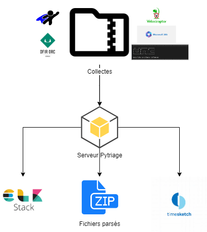
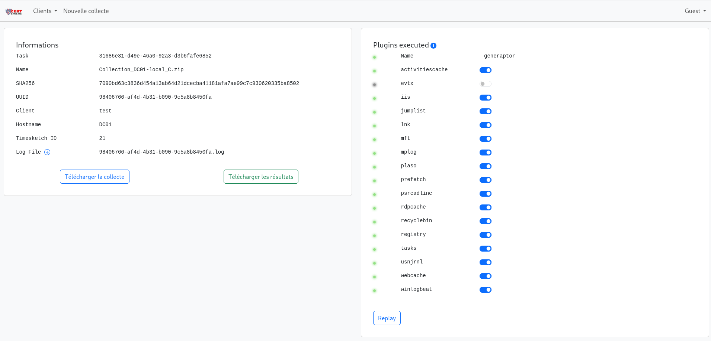

<p align="center">

</p>

<div align="center">


</div>

<div align="center">

[Introduction](#introduction) | [Fonctionnement](#fonctionnement) | [Ajout de plugin](#ajout-de-plugin) | [Déploiement](#déploiement)

</div>

## Introduction

Le serveur de triage a pour but d'automatiser le traitement des collectes effectuées sur les systèmes à investiguer. Il effectue le *processing* de certaines tâches (*timelining* et détection SIGMA notamment) ainsi que le *forwarding* vers les outils d'analyses (pile ELK et Timesketch si configuré dans config/triage.yaml).

Actuellement, le serveur de triage effectue le traitements des collectes suivantes :

- KAPE / DFIR-ORC / GENERAPTOR Windows
- UAC / GENERAPTOR Linux
- ADTIMELINE
- VOLATILITY Windows
- DFIR-O365RC
- ADAUDIT
- MAIL (pst/mbox)
- Google Workspace

## Fonctionnement

Le service Pytriage est développé en python 3.9, la montée de version sera dépendante des packages et autres librairies utilisées (voir requirements.txt). 
Le serveur web utilise le package Flask pour le serveur web, CELERY pour le traitement en parallèle de collectes et d'une base REDIS (pour celery).
L'authentification si activée se fait via Keycloak.

<p align="center">

</p>

### Interface

La barre de navigation permet de :

- Accéder aux collectes en cours de traitement et passées
- Accéder à la partie "administration"
- Initialiser la page pour une nouvelle collecte

Chaque collecte concerne :

- 1 client
- 1 machine ou tenant

<p align="center">

</p>

### Plugins


#### KAPE

> Ce plugin s'exécute sur une collecte réalisée par kape. Le fichier d'entrée est l'archive ZIP contenant le fichier VHDX généré par l'outil de collecte.

Ce plugin dézippe l'archive, monte le vhdx fournis dans un dossier créé et propre à chaque collecte.

Plusieurs artefacts sont traités si sélectionnés dans l'interface :

- Les EVTX sont copiés dans un dossier puis envoyés à la VM Winlogbeat pour parsing et indexation
- Les EVTX sont parsés (par la lib python) puis envoyés à ELK
- Exécution Hayabusa sur les EVTX
- Les logs IIS seront extraits du vhdx, copiés dans un dossier, parsés puis envoyés à ELK
- Les timelines Plaso seront créées puis envoyées à Timesketch
- Parsing MFT
- Parsing USNJrnl
- Parsing Registres (amcache, system, security, ntuser...)
- Parsing prefetch
- Parsing MPLog
- Parsing Windows10 Timeline (ActivitiesCache)
- Parsing $Recycle.Bin
- Récupération des fichiers d'historique Powershell des utilisateurs
- RDP Bitmap Cache parser
- Parsing LNK
- Parsing JumpList
- Parsing Tasks
- Parsing Webcache

#### GENERAPTOR Windows

> Ce plugin s'exécute sur une collecte réalisée par [generaptor](https://github.com/CERT-EDF/generaptor/tree/main). Le fichier d'entrée est l'archive ZIP générée par l'outil de collecte, le fichier private key pour déchiffrer l'archive et le mot de passe de cette clé. 


Plusieurs artefacts sont traités si sélectionnés dans l'interface :

- Les EVTX sont copiés dans un dossier puis envoyés à la VM Winlogbeat pour parsing et indexation
- Les EVTX sont parsés (par la lib python) puis envoyés à ELK
- Exécution Hayabusa sur les EVTX
- Les logs IIS seront extraits du ZIP, copiés dans un dossier, parsés puis envoyés à ELK
- Une timeline Plaso est créée puis envoyée à Timesketch
- Parsing MFT
- Parsing USNJrnl
- Parsing Registres (amcache, system, security, ntuser...)
- Parsing prefetch
- Parsing MPLog
- Parsing Windows10 Timeline (ActivitiesCache)
- Parsing $Recycle.Bin
- Récupération des fichiers d'historique Powershell des utilisateurs
- RDP Bitmap Cache parser
- Parsing LNK
- Parsing JumpList
- Parsing Tasks
- Parsing Webcache

#### DFIR-ORC

> Ce plugin s'exécute sur une collecte réalisée par [DFIR-ORC](https://github.com/DFIR-ORC/dfir-orc). Le fichier d'entrée est l'archive chiffrée (.7z.p7b) générée par l'outil de collecte de l'ANSSI.


Plusieurs artefacts sont traités si sélectionnés dans l'interface :

- Les EVTX sont copiés dans un dossier puis envoyés à la VM Winlogbeat pour parsing et indexation
- Les EVTX sont parsés (par la lib python) puis envoyés à ELK
- Exécution Hayabusa sur les EVTX
- Une timeline Plaso est créée puis envoyée à Timesketch
- Parsing MFT
- Parsing USNJrnl
- Parsing Registres (amcache, system, security, ntuser...)
- Parsing prefetch
- Parsing MPLog
- Parsing Windows10 Timeline (ActivitiesCache)
- Parsing $Recycle.Bin
- Récupération des fichiers d'historique Powershell des utilisateurs
- RDP Bitmap Cache parser
- Parsing LNK
- Parsing JumpList
- Parsing Tasks
- Parsing Webcache

#### GENERAPTOR Linux

> Ce plugin s'exécute sur une collecte réalisée par [generaptor](https://github.com/CERT-EDF/generaptor/tree/main). Le fichier d'entrée est l'archive ZIP générée par l'outil de collecte, le fichier private key pour déchiffrer l'archive et le mot de passe de cette clé. 


Plusieurs artefacts sont traités si sélectionnés dans l'interface :

- Une timeline Plaso est créée puis envoyées à Timesketch
- PSORT est exécuté sur le plaso précédement généré
- Filebeat indexera dans ELK les logs capturés lors de la collecte

#### Hayabusa

Doit être exécuté en même temps que Kape ou Generaptor (windows) ou DFIR-ORC pour analyser les EVTX présents et envoyer les résultats à ELK

#### UAC

> Ce plugin s'exécute sur une collecte réalisée par UAC. Le fichier d'entrée est l'archive TAR générée par l'outil de collecte du CERT.


Deux artefacts sont traités dans ce plugin :

- Filebeat indexera dans ELK les logs capturés lors de la collecte
- Une timelines Plaso est créée puis envoyée à Timesketch
- PSORT est exécuté sur le plaso précédement généré

#### ADTimeline

> Ce plugin s'exécute sur une collecte réalisée par l'outil ADTimeline de l'ANSSI. Le fichier d'entrée est le CSV généré.


Le plugin parse le fichier CSV puis l'envoie à ELK.

#### Volatility

> Ce plugin s'exécute sur un dump mémoire d'une machine windows.


Pour le moment 4 plugins volatility3 sont développés et utilisables:

- PSLIST
- PSTREE
- NETSCAN
- NETSTAT

Les résultats générés sont parsés et envoyés à ELK.

#### o365

> Ce plugin s'exécute sur les fichiers json générés par l'outil de collecte DFIR-O365RC de l'ANSSI. Le fichier d'entrée est une archive ZIP contenant ces fichiers json.


L'archive envoyée est dézippée et les fichiers json présents sont parsés puis envoyés à ELK.

#### Mail
> Ce plugin s'exécute sur les fichiers PST et MBOX. Le fichier d'entrée est une archive ZIP contenant ces fichiers.

L'archive envoyée est dézippée et les fichiers PST/MBOX présents sont parsés puis envoyés à ELK. Une option est proposée pour récupérer ou non les pièces-jointes des mails.

#### Google Workspace
> Ce plugin s'exécute sur les fichiers JSON générés par l'outil de collecte [ALFA](https://github.com/invictus-ir/ALFA). Le fichier d'entrée est une archive ZIP contenant ces fichiers.

L'archive envoyée est dézippée et les fichiers JSON présents sont parsés puis envoyés à ELK.


### Standalone


Cette partie permet de faciliter l'exécution d'un plugin sur des artefacts spécifiques.


Le principe reste sensiblement le même que dans la partie précédente, les fichiers envoyés concernent un client et une machine.

Les plugins disponibles sont :

- Hayabusa
	- une éxécution d'hayabusa a été faite à la main par l'analyste et il souhaite envoyer le fichier de résultat dans ELK. Le fichier attendu est le résultat hayabusa au format JSONL
- WINLOGBEAT
	- L'analyste a uniquement récupéré les fichiers evtx sur une machine et souhaite les indexer par winlogbeat dans ELK. Le fichier attendu est une archive ZIP contenant tous les fichiers evtx.
- EVTX 
	- L'analyste a uniquement récupéré les fichiers evtx sur une machine et souhaite les parser par le triage et non winlogbeat, ils seront ensuite envoyés à ELK. Le fichier attendu est une archive ZIP contenant tous les fichiers evtx.
- FORTINET
	- Parsing des logs fortinet (txt/log).Le fichier attendu est une archive ZIP contenant les logs.

### Administration

Une page d'administration est accesssible pour le moment à tout le monde car aucune gestion des utilisateurs n'est en place.


Elle permet:
- D'avoir une vue sur l'ensemble des collectes
- De supprimer des collectes
- De relancer des collectes
- D'arrêter des triages en cours
- De récupérer les fichier de log des collectes
- De supprimer des sketch TIMESKETCH
- De supprimer des index ELASTIC
- De mettre à jour HAYABUSA
- De voir les connexions aux pipelines LOGSTASH


## Ajout de plugin
Créer un nouveau fichier dans le dossier *plugins*, le nom du fichier doit être le même que celui mis dans la clé *run* de la config (voir generate_config)
(ie: 1 Plugin = 1 format de collecte)

La base de code doit être:
(le logger est passé partout en paramètre mais pas utilisé car il sert au decorateur LOG)

```python
import os
from logging import Logger
from src.thirdparty import triageutils as triageutils
from src import BasePlugin

class Plugin(BasePlugin):
    """
    <plugin_name> plugin pour ...
    """ 

    def __init__(self, conf: dict):
        super().__init__(config=conf)
        
    
    @triageutils.LOG
    def run(self, logger:Logger):
        """Fonction principale qui exécute ...
        
        Args:
            
        Returns:
            
        """
        try:
            #calls
        except Exception as ex:
            self.error(f"[MyPlugin ERROR] {str(ex)}")
            raise ex
```

## PyTriage utilise des outils externes

### Libs / Fonctions

* [Plaso](https://github.com/log2timeline/plaso)
* [analyzeMFT](https://github.com/rowingdude/analyzeMFT)
* [regipy](https://pypi.org/project/regipy/)
* [Hayabusa](https://github.com/Yamato-Security/hayabusa)
* [Generaptor](https://github.com/CERT-EDF/generaptor)
* [Orc-decrypt](https://github.com/DFIR-ORC/orc-decrypt)
* [Mplog-parser](https://github.com/Intrinsec/mplog_parser)
* [USN-Journal-Parser](https://github.com/PoorBillionaire/USN-Journal-Parser)
* [Mail parsers](https://github.com/Intrinsec/mplog_parser)
* [RDP Cache parser](https://github.com/ANSSI-FR/bmc-tools)

### Images Docker

* Plaso
* Filebeat
* Volatility

## Déploiement

Le serveur de triage est déployé comme un service docker.

### Configuration

La configuration est présente dans le fichier **config/triage.yaml**.
Il est possible d'activer ou non les connexions aux services tiers Timesketch, ELK et Winlogbeat.

#### Keycloak bindings
Pour utiliser l'authentification via keycloak, il faut renseigner les variables d'environnement présentes dans le fichier **docker-compose.yml**
Les utilisateurs doivent être membre des groupes définis dans keycloak pour accéder aux interfaces correspondantes (ici *admin* / *cert*).

```yaml
USE_KEYCLOAK=<False/True>
KEYCLOAK_SERVER_URL=<keycloak url>
KEYCLOAK_REALM=<realm name>
KEYCLOAK_CLIENT_ID=<client ID>
KEYCLOAK_CLIENT_SECRET=<client secret>
REDIRECT_URI=<callback url> #https://<pytriage IP>/callback
KEYCLOAK_ADMIN_GROUP=ADMIN
KEYCLOAK_USERS_GROUP=CERT
```

### Prérequis

Créer les dossiers **data**, **winlogbeat**, **log** et **hayabusa** si non présents (chemin à renseigner dans les fichiers docker-compose-build/prod.yml et dans config/triage.yaml *volumes => data* qui est le volume hôte à monter donc ici ./data)
```bash
mkdir /winlogbeat
mkdir -p /data/hayabusa
```
- Monter le partage winlogbeat dans le dossier précédement créé
- Placer le binaire hayabusa et ses dépendances dans le dossier précédement créé

Générer les certificats SSL

```bash
openssl req -x509 -out config/certs/pytriage.crt -keyout config/certs/pytriage.key -newkey rsa:2048 -nodes -days 1000 -sha256 -subj '/CN=pytriage' -extensions EXT -config <( printf "[dn]\nCN=localhost\n[req]\ndistinguished_name = dn\n[EXT]\nsubjectAltName=DNS:localhost\nkeyUsage=digitalSignature\nextendedKeyUsage=serverAuth")
```

Permettre à la VM de se connecter à un partage distant (winlogbeat)
```bash
sudo apt install cifs-utils
```

Start docker images

```bash
docker compose -f Docker/docker-compose.yml up -d
```

Le service web est disponible sur https://localhost

# Contributors

* [A-Lvu](https://github.com/A-Lvu)
* [SelfDestructAccount](https://github.com/SelfDestructAccount)